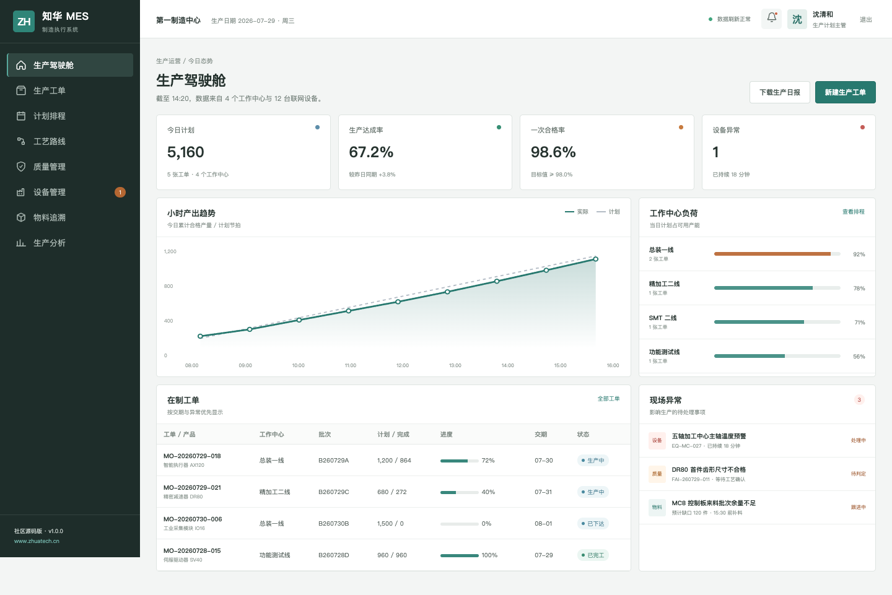
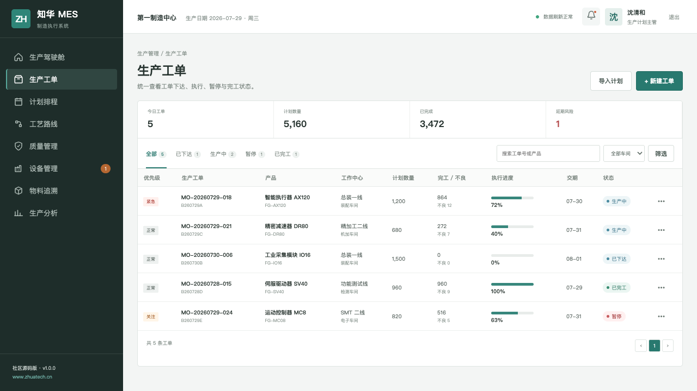
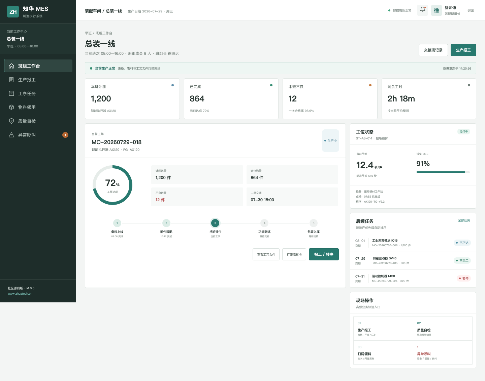
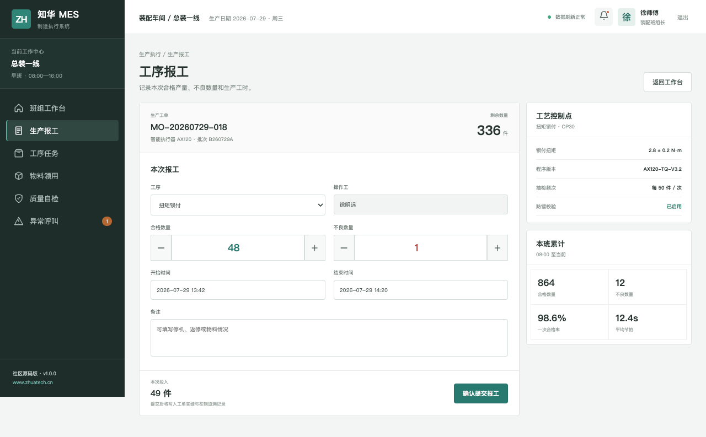

# ZhuaTech MES｜知华科技制造执行系统社区源码版

> 把生产计划变成现场动作，把每次报工、检验与异常沉淀为可以追溯的制造事实。

[](backend/pom.xml)
[](backend/pom.xml)
[](frontend/package.json)
[](compose.yaml)
[](LICENSE)

ZhuaTech MES 是 **知华科技（上海如静知华信息科技有限公司）** 面向离散制造场景推出的制造执行系统社区源码版。项目采用 Java + Vue 前后端分离架构，包含适合车间触屏与手机浏览器的生产执行端，以及面向计划、质量和设备人员的管理端。

- 官方网站：[https://www.zhuatech.cn/](https://www.zhuatech.cn/)
- 技术关键词：MES、制造执行系统、生产工单、工序报工、质量追溯、设备管理、生产看板
- 许可边界：仅限个人、非商业学习研究和技术交流；商用必须取得书面授权

## 一条工单如何在系统里流转

```text
ERP/计划订单
     ↓
生产工单 → 工艺路线 → 工作中心派工 → 工位执行/报工
                                      ↓
                               首检/巡检/异常呼叫
                                      ↓
                           完工检验 → 批次追溯 → 入库
```

社区版本重点呈现“计划下达到现场反馈”的完整闭环。接口层保留清晰的领域边界，便于在取得商业授权后继续集成 ERP、WMS、QMS、PLC、边缘网关或条码设备。

## 产品界面

### 生产驾驶舱



管理端将小时产出、工作中心负荷、在制工单与现场异常放在同一屏。计划主管可以先判断当天能否按期完成，再下钻到设备报警、首件不合格和缺料事件。

### 生产工单



工单列表同时呈现产品、批次、工作中心、计划数量、完工数量、不良数、执行进度与交期。紧急、关注和暂停状态使用克制的业务色标记，适合长时间办公使用。

### 车间执行端



执行端围绕当前工单设计：工单达成、工序节点、工位节拍、设备 OEE 和后续任务均可快速读取。页面响应式适配桌面、车间触屏和 H5 浏览器。

### 工序报工



报工页面减少现场输入项，突出合格数、不良数和关键工艺参数。后端接口会校验剩余数量并同步更新工单实绩，形成可继续扩展的生产记录。

## 社区版能力清单

| 业务域 | 已提供 | 可继续扩展方向 |
| --- | --- | --- |
| 生产计划 | 工单下达、优先级、交期、工作中心 | APS 排程、齐套校验、插单与拆并单 |
| 车间执行 | 班次任务、工序流转、合格/不良报工 | 扫码防错、电子作业指导书、多人协作 |
| 质量管理 | 首检、巡检、完工检验、检验结果 | SPC、缺陷代码、返工返修、质量放行 |
| 设备管理 | 运行/待机/报警、OEE、心跳时间 | 点检保养、Andon、IoT/PLC 实时采集 |
| 物料追溯 | 产品批次与工单关联模型 | 上料校验、正反向追溯、序列号管理 |
| 生产分析 | 计划达成、小时产出、负荷、异常 | 停机损失、绩效班报、能源与成本分析 |
| 安全权限 | JWT、操作工/计划/质量/管理员角色 | 组织权限、数据范围、审计日志、SSO |

## 工程结构

```text
zhuatech-mes/
├── frontend/                       Vue 3 + Vite，管理端与车间 H5
│   └── src/views/
│       ├── admin/                  生产计划与运营管理页面
│       └── shopfloor/              班组工作台和工序报工页面
├── backend/                        Java 21 + Spring Boot
│   └── src/main/java/cn/zhuatech/mes
│       ├── controller/             REST 接口与角色权限
│       ├── service/                工单、报工与看板业务规则
│       ├── model/                  制造领域实体
│       └── repository/             JPA 数据访问
├── docs/                           架构、数据库、接口与页面图片
├── deploy/                         生产部署注意事项
└── compose.yaml                    MySQL、后端和前端编排
```

数据库表统一使用 `mes_` 前缀，Flyway 负责版本化建表。后端使用 Controller → Service → Repository 分层；前端通过角色进入 `/shopfloor` 或 `/admin`，演示模式不依赖后端即可查看完整样式。

## 快速体验

### Docker Compose

```bash
cp .env.example .env
docker compose up --build
```

启动后访问 `http://localhost:8090`。示例密码仅供本地体验，上线前必须更换数据库密码、JWT 密钥并删除演示账号。

### 本地开发

环境要求：Java 21、Maven 3.9+、Node.js 20+、MySQL 8.x。

```bash
# 后端
cd backend
mvn spring-boot:run

# 新终端启动前端
cd frontend
npm install
npm run dev
```

无需 MySQL、仅查看页面：

```bash
cd frontend
npm install
npm run dev:demo
```

## 演示账号

| 入口 | 账号 | 密码 | 角色 |
| --- | --- | --- | --- |
| 车间执行端 | `operator` | `Demo@2026` | 总装一线操作工 |
| 生产管理端 | `planner` | `Demo@2026` | 生产计划主管 |
| 生产管理端 | `quality` | `Demo@2026` | 质量工程师 |
| 系统管理 | `admin` | `ZhuaTech@2026` | 系统管理员 |

## 部署前必须检查

1. 将 `.env.example` 复制为本地 `.env`，不要提交真实配置；
2. 使用至少 32 字节的随机 JWT 密钥并定期轮换；
3. 删除或禁用全部演示账号，限制 CORS 来源并启用 HTTPS；
4. 生产网络与办公网络分区，设备接入应通过受控边缘网关；
5. 对工艺参数、追溯数据、导出权限和操作日志进行专项安全评审；
6. 配置数据库备份、恢复演练、监控告警和依赖漏洞扫描。

详细说明见 [部署指南](deploy/README.md)、[系统架构](docs/architecture.md)、[接口文档](docs/api.md) 与 [数据库说明](docs/database.md)。

## 使用许可

本工程仅允许个人用于非商业性的学习、研究与技术交流，**不得用于任何直接或间接商业用途**。企业内部使用、生产部署、SaaS、客户交付、投标、咨询实施、培训收费、品牌替换等均属于商业使用，必须事先获得上海如静知华信息科技有限公司的书面授权。

完整条款以 [LICENSE](LICENSE) 为准。该许可含非商业限制，因此本项目是公开可见的社区源码项目（source-available），不是 OSI 定义的开源软件。

## 深度定制与商业授权

如果需要多工厂、多组织、APS 排程、ERP/WMS/QMS 集成、PLC/IoT 数据采集、条码追溯、电子作业指导书、国产化适配或生产级部署，请联系 **知华科技（上海如静知华信息科技有限公司）**。

- 官网：[https://www.zhuatech.cn/](https://www.zhuatech.cn/)
- 咨询内容建议包含：行业、工厂规模、主要产品、现有系统、设备协议和预期上线范围

也可以扫描以下任一微信二维码咨询：

<p align="center">
  
  &nbsp;&nbsp;&nbsp;&nbsp;
  
</p>

## 参与改进

提交 Issue 或 Pull Request 前请阅读 [CONTRIBUTING.md](CONTRIBUTING.md) 与 [CODE_OF_CONDUCT.md](CODE_OF_CONDUCT.md)。请勿提交真实工艺参数、生产订单、设备地址、追溯数据、账号密钥或个人信息。

Copyright © 2026 上海如静知华信息科技有限公司。保留所有权利。
